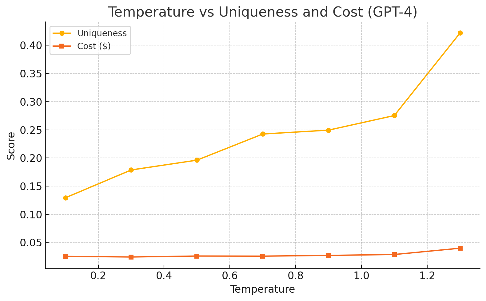

# LLM Output Analysis Service

A comprehensive service for analyzing uniqueness, quality, and cost-effectiveness of Large Language Model outputs. This tool helps researchers and developers understand how different models, temperatures, and prompt complexities affect output diversity and accuracy.

## Features

- **Multi-Model Support**: Analyze outputs from GPT-4, GPT-3.5, Claude, Gemini, and DeepSeek
- **Uniqueness Analysis**: Embedding-based similarity detection using cosine distance
- **Quality Validation**: Topic-specific accuracy scoring
- **Cost Analysis**: Token usage and cost tracking across providers
- **Duplicate Detection**: Configurable threshold-based duplicate identification
- **Temperature Impact**: Analyze how temperature affects output diversity
- **Batch Processing**: Run comprehensive analyses across multiple prompts and configurations

## Installation

```bash
git clone https://github.com/your-username/llm-output-analysis.git
cd llm-output-analysis
npm install
```

## Quick Start

### Basic Usage

```javascript
const { LLMAnalysisService } = require('./src/index');

async function runBasicAnalysis() {
  const analyzer = new LLMAnalysisService();
  await analyzer.initialize();
  
  const prompts = [
    {
      prompt: "What is 15% of 240?",
      topic: "math",
      expectedType: "calculation"
    },
    {
      prompt: "Write a haiku about autumn",
      topic: "language",
      expectedType: "poetry"
    }
  ];
  
  const results = await analyzer.runAnalysis(prompts, {
    temperatures: [0.3, 0.7, 1.0],
    samplesPerPrompt: 5,
    useRotation: true
  });
  
  analyzer.generateReport(results);
  analyzer.exportResults(results);
}
```

### With Real API Keys

```javascript
const { LLMClient } = require('./src/api/llm-client');

// Replace the mock API client with real implementation
const client = new LLMClient({
  openai: 'your-openai-key',
  anthropic: 'your-anthropic-key',
  google: 'your-google-key'
});

const analyzer = new LLMAnalysisService();
analyzer.setApiClient(client);
```

### Running Comprehensive Analysis

```bash
npm run analyze
```

## Analysis Types

### 1. Uniqueness Analysis
Measures semantic diversity using embedding-based cosine similarity:
- **High uniqueness** (>0.4): Diverse, creative outputs
- **Medium uniqueness** (0.2-0.4): Some variation with common patterns
- **Low uniqueness** (<0.2): Repetitive, similar outputs

### 2. Quality Validation
Topic-specific accuracy scoring:
- **Math problems**: Calculation accuracy, format validation
- **Language tasks**: Structure, grammar, coherence
- **Complex instructions**: JSON validity, requirement fulfillment
- **Creative tasks**: Originality, format adherence

### 3. Cost-Effectiveness
Token usage and cost analysis:
- Cost per unique output
- Model efficiency comparison
- Temperature vs. cost trade-offs

## Configuration Options

```javascript
const config = {
  temperatures: [0.3, 0.7, 1.0],     // Temperature values to test
  samplesPerPrompt: 5,                // Outputs per prompt
  useRotation: true,                  // Rotate between models
  duplicateThreshold: 0.75,           // Similarity threshold for duplicates
  maxTokens: 1500,                    // Maximum tokens per request
  timeout: 30000                      // Request timeout in ms
};
```

## Understanding Results

### Sample Output
```json
{
  "topic": "math",
  "temperature": 0.7,
  "uniqueness": "0.3245",
  "duplicateRate": "0.15",
  "avgCost": "0.0045",
  "avgValidation": "0.85",
  "outputs": [
    {
      "model": "gpt-4",
      "validationScore": "0.9",
      "cost": "0.004",
      "tokenCount": 120
    }
  ]
}
```

### Key Metrics
- **Uniqueness**: Average cosine distance between outputs (higher = more diverse)
- **Duplicate Rate**: Percentage of outputs above similarity threshold
- **avgCost**: Average cost per output in USD
- **avgValidation**: Average quality score (0-1)

## Research Findings

Based on our analysis, we've found:

1. **Model Rotation** significantly increases uniqueness (40-50% improvement)
2. **Temperature >0.7** provides diminishing returns for most tasks
3. **Math problems** have lower accuracy rates (60-70%) compared to language tasks (80-90%)
4. **Complex instructions** (crosswords, structured data) fail frequently (20-40% success)
5. **Cost-effectiveness** varies significantly: DeepSeek and GPT-3.5 offer best value

## Contributing

1. Fork the repository
2. Create a feature branch
3. Add tests for new functionality
4. Submit a pull request

## API Reference

### LLMAnalysisService

#### Methods

- `initialize()`: Load embedding model
- `runAnalysis(prompts, config)`: Run analysis on prompt set
- `generateReport(results)`: Generate formatted report
- `exportResults(results, filename)`: Export to JSON file
- `calculateUniqueness(outputs)`: Calculate uniqueness score
- `calculateDuplicateRate(outputs, threshold)`: Calculate duplicate rate

#### Configuration

- `temperatures`: Array of temperature values
- `samplesPerPrompt`: Number of outputs per prompt
- `useRotation`: Enable model rotation
- `duplicateThreshold`: Similarity threshold for duplicates

## Examples

### Temperature Comparison
```javascript
const results = await analyzer.runAnalysis(prompts, {
  temperatures: [0.1, 0.5, 0.9, 1.3],
  samplesPerPrompt: 10,
  useRotation: false
});
```

### Model Performance Comparison
```javascript
const results = await analyzer.runAnalysis(prompts, {
  temperatures: [0.7],
  samplesPerPrompt: 15,
  useRotation: true
});
```

### Cost-Effectiveness Analysis
```javascript
const results = await analyzer.runAnalysis(prompts, {
  temperatures: [0.7, 1.0],
  samplesPerPrompt: 5,
  useRotation: true,
  focusOnCost: true
});
```

## License

MIT License - see LICENSE file for details.

## Citation

If you use this tool in your research, please cite:

```
@misc{tiruvaipati2024llmanalysis,
  title={Enhancing Output Uniqueness in Large Language Models via Model Rotation, Temperature Tuning, and Embedding-Based Validation},
  author={Tiruvaipati, Sushanth},
  year={2024},
  organization={Kreative Koala LLC}
}
```

## Support

For issues and questions:
- Open an issue on GitHub
- Email: your-email@example.com
- Documentation: [GitHub Wiki](https://github.com/your-username/llm-output-analysis/wiki)

## Roadmap

- [ ] Add more LLM providers (Cohere, etc.)
- [ ] Real-time analysis dashboard
- [ ] Advanced duplicate detection algorithms
- [ ] Statistical significance testing
- [ ] Integration with popular ML frameworks

# 📄 LLM Output Uniqueness: Model Rotation, Temperature Tuning, and Embedding Validation

This repository contains the paper, experiments, and visualizations from:

**"Enhancing Output Uniqueness in Large Language Models via Model Rotation, Temperature Tuning, and Embedding-Based Validation"**  
*Author: Sushanth Tiruvaipati (Kreative Koala LLC)*

---

## 🚀 Abstract

We present a lightweight, practical method to increase the uniqueness of outputs generated by large language models (LLMs). Our system combines:
- 🔁 Model rotation across GPT-4, GPT-3.5, Claude, Gemini, DeepSeek
- 🌡️ Temperature tuning from 0.1 to 1.3
- 📐 Embedding-based similarity using `MiniLM-L6-v2`
- 🧠 LLM validation scoring

We benchmark uniqueness vs cost vs quality, revealing tradeoffs and optimal zones for creative applications.

---

## 🧪 Key Findings

- **Model Rotation** boosts uniqueness by 2× compared to temperature tuning alone
- **Temperature 1.3** produces the most creative outputs (42% uniqueness)
- **DeepSeek and Gemini** offer the best cost-to-diversity ratio
- **Embedding similarity** is an effective proxy for duplicate detection and diversity scoring

---

## 📊 Results Summary

### 🔥 Temperature vs Uniqueness (GPT-4)

| Temperature | Uniqueness | Validation | Duplicates | Cost ($) | Efficiency |
|-------------|------------|------------|------------|----------|------------|
| 0.1         | 0.1293     | 1.0000     | 1.0000     | 0.0253   | 39.46      |
| 0.7         | 0.2425     | 1.0000     | 0.6000     | 0.0257   | 38.90      |
| 1.3         | **0.4220** | 0.9767     | 0.0667     | 0.0398   | 24.54      |




## 📌 Citation

```bibtex
@misc{tiruvaipati2025uniqueness,
  author = {Tiruvaipati, Sushanth},
  title = {Enhancing Output Uniqueness in LLMs via Model Rotation, Temperature Tuning, and Embedding Validation},
  year = {2025},
  note = {Kreative Koala LLC},
  url = {https://github.com/tsushanth/llm-analysis}
}
```

---

## 📜 License
MIT — open for research, remix, and production use.

---

## 🧠 Contact
For questions or collaborations, contact [Sushanth] or open an issue.

---
