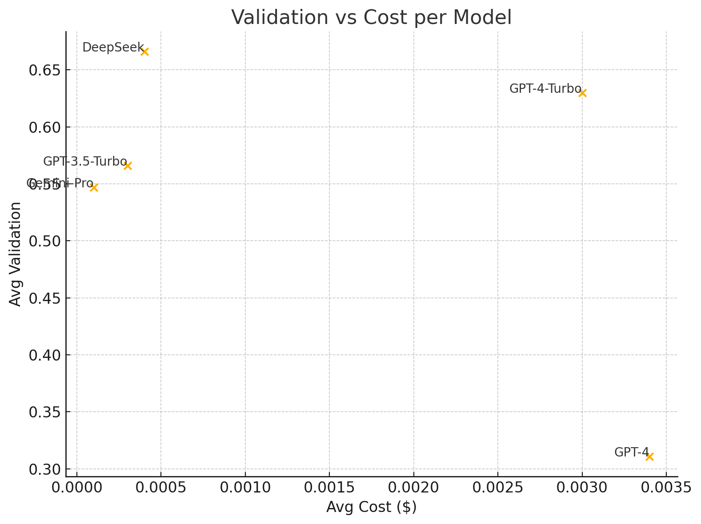

# Summary

We present a lightweight, practical method to increase the uniqueness of outputs generated by large language models (LLMs). Our approach combines: (1) temperature sampling, (2) rotation between diverse LLM APIs, (3) embedding-based uniqueness validation, and (4) an in-production deduplication pipeline. 

We compare six production-grade LLMs (GPT-4, GPT-4-Turbo, GPT-3.5-Turbo, Claude-3-Sonnet, Gemini-Pro, and DeepSeek), analyze cost-vs-uniqueness trade-offs, and propose a metric for uniqueness using cosine similarity between embedding vectors of generated outputs.

We show that controlled rotation combined with moderate temperature tuning can significantly enhance output variability while staying within acceptable cost and quality bounds.

# Statement of Need

As LLM usage increases in areas such as content creation and puzzle generation, repeated and convergent responses become a limiting factor. While temperature tuning is commonly used to control diversity, it alone is insufficient. This work fills a practical need for developers and researchers who require **high-uniqueness outputs** without sacrificing interpretability, cost efficiency, or production readiness.

# System Architecture

Our Node.js service integrates:

- A rotating pool of LLMs.
- MiniLM-based embedding validation.
- Prompt uniqueness scoring.
- Structural deduplication logic.

Each request is routed through temperature-controlled model sampling, embedding similarity evaluation, and optionally flagged or discarded if similarity exceeds a set threshold.

# Methodology

- **Temperature Sweeps:** Ranging from 0.1 to 1.3.
- **Model Rotation:** Round-robin across LLM APIs.
- **Uniqueness Metric:** Cosine distance of MiniLM sentence embeddings.
- **Cost Tracking:** Based on token usage and provider billing.

# Results

## Prompt Type Analysis: Science + Math @ Temp = 0.7

| Model           | Avg Validation | Avg Cost ($) | Efficiency |
|----------------|----------------|--------------|------------|
| GPT-4          | 0.311          | 0.0034       | 92.7       |
| GPT-4-Turbo    | 0.630          | 0.0030       | 212.4      |
| GPT-3.5-Turbo  | 0.566          | 0.0003       | 1887.4     |
| Gemini-Pro     | 0.547          | 0.0001       | 4100.0     |
| DeepSeek       | 0.666          | 0.0004       | 1537.2     |

## Complexity Analysis

| Task Complexity        | Validation | Cost ($) | Efficiency | Notes                     |
|------------------------|------------|----------|------------|---------------------------|
| Trivial (Math)         | 0.2500     | 0.0001   | 2851.7     | GPT-4-Turbo best          |
| Medium (Math)          | 0.6667     | 0.0008   | 837.9      | GPT-4-Turbo excels        |
| Hard (Math)            | 0.6333     | 0.0012   | 529.8      | GPT-3.5-Turbo shines      |
| Very Hard (Crossword)  | 0.1000     | 0.0011   | 92.1       | Gemini leads despite low score |

## Temperature vs Creativity (GPT-4)

| Temperature | Uniqueness | Validation | Duplicates | Cost ($) | Efficiency |
|-------------|------------|------------|------------|----------|------------|
| 0.1         | 0.1293     | 1.0000     | 1.0000     | 0.0253   | 39.46      |
| 0.3         | 0.1787     | 1.0000     | 1.0000     | 0.0242   | 41.40      |
| 0.5         | 0.1961     | 1.0000     | 0.8000     | 0.0259   | 38.67      |
| 0.7         | 0.2425     | 1.0000     | 0.6000     | 0.0257   | 38.90      |
| 0.9         | 0.2494     | 1.0000     | 0.3333     | 0.0270   | 37.06      |
| 1.1         | 0.2753     | 1.0000     | 0.4000     | 0.0286   | 34.92      |
| 1.3         | 0.4220     | 0.9767     | 0.0667     | 0.0398   | 24.54      |

## Figures

# Discussion

Model rotation significantly enhances uniqueness beyond temperature tuning alone. Our validation and deduplication methods—based on MiniLM embeddings—enable scoring and filtering in real time. DeepSeek and GPT-3.5-Turbo offer high uniqueness per dollar, while Gemini-Pro, though efficient, struggles on complex prompts.

# Conclusion

Our framework offers a pragmatic way to increase response diversity in LLM applications. Combining rotation, temperature control, and embedding-based validation yields demonstrably higher uniqueness with minimal overhead.

# References

::: {#refs}
- OpenAI Pricing: https://openai.com/pricing  
- Sentence Transformers: https://www.sbert.net  
- Anthropic Claude API: https://docs.anthropic.com  
- Gemini API: https://ai.google.dev  
- DeepSeek API: https://deepseek.com  
:::
